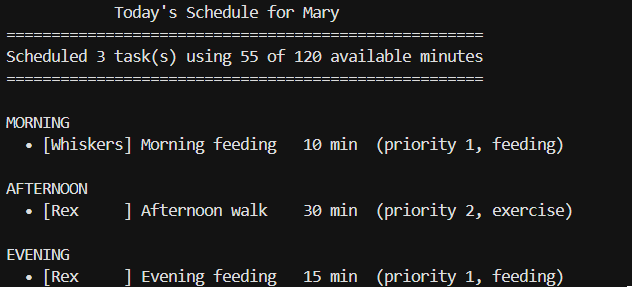
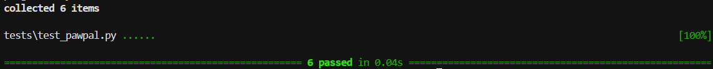

# PawPal+ (Module 2 Project)

You are building **PawPal+**, a Streamlit app that helps a pet owner plan care tasks for their pet.

## Scenario

A busy pet owner needs help staying consistent with pet care. They want an assistant that can:

- Track pet care tasks (walks, feeding, meds, enrichment, grooming, etc.)
- Consider constraints (time available, priority, owner preferences)
- Produce a daily plan and explain why it chose that plan

Your job is to design the system first (UML), then implement the logic in Python, then connect it to the Streamlit UI.

## What you will build

Your final app should:

- Let a user enter basic owner + pet info
- Let a user add/edit tasks (duration + priority at minimum)
- Generate a daily schedule/plan based on constraints and priorities
- Display the plan clearly (and ideally explain the reasoning)
- Include tests for the most important scheduling behaviors

## Getting started

### Setup

```bash
python -m venv .venv
source .venv/bin/activate  # Windows: .venv\Scripts\activate
pip install -r requirements.txt
```

### Suggested workflow

1. Read the scenario carefully and identify requirements and edge cases.
2. Draft a UML diagram (classes, attributes, methods, relationships).
3. Convert UML into Python class stubs (no logic yet).
4. Implement scheduling logic in small increments.
5. Add tests to verify key behaviors.
6. Connect your logic to the Streamlit UI in `app.py`.
7. Refine UML so it matches what you actually built.

## 🖥️ Sample Output

Paste a sample of your app's CLI or Streamlit output here so a reader can see what a generated plan looks like:


```
# e.g.:
# Daily plan for Biscuit (Golden Retriever):
#   08:00 — Morning walk (30 min) [priority: high]
#   09:00 — Feeding (10 min) [priority: high]
#   ...
```

## 🧪 Testing PawPal+

Run the test suite from the project root:

```bash
# Run the full test suite:
python -m pytest

# Run with coverage:
python -m pytest --cov
```

The tests live in [tests/test_pawpal.py](tests/test_pawpal.py) and cover the core scheduling behaviors:

| Test | What it verifies |
|------|------------------|
| `test_add_task_increases_pet_task_count` | Adding a task to a `Pet` grows its task list by one. |
| `test_mark_complete_changes_status` | `Task.mark_complete()` flips a task's status from incomplete to complete. |
| `test_sort_by_time_returns_chronological_order` | `Scheduler.sort_by_time()` returns tasks earliest-to-latest and does not mutate the original list. |
| `test_completing_daily_task_creates_task_for_next_day` | Completing a `daily` recurring task marks it done and appends a fresh, incomplete occurrence for the next day. |
| `test_detect_conflicts_flags_duplicate_times` | `Scheduler.detect_conflicts()` raises one warning per contested time slot, naming the time and clashing tasks. |
| `test_detect_conflicts_returns_empty_when_all_times_unique` | `detect_conflicts()` returns an empty list when no tasks share a time slot. |



My confidence level is a 3/5 stars in the system's reliability based on the test results, mainly because there is still other functionality that must be tested.

## 📐 Smarter Scheduling

| Feature | Method(s) | Notes |
|---------|-----------|-------|
| Task sorting | `Scheduler.sort_by_time()`, `Scheduler.organize_by_priority()` | `sort_by_time()` uses a lambda as the sort `key` on the task's `"HH:MM"` time string; zero-padded 24-hour times sort chronologically as plain strings (`"08:00" < "14:00"`). `organize_by_priority()` sorts by priority (lower number = higher). |
| Filtering | `Scheduler.filter_by_pet()`, `Scheduler.filter_to_constraints()` | `filter_by_pet()` keeps only the tasks for a given pet name via the `pet_by_task` map. `filter_to_constraints()` drops completed tasks and greedily includes tasks while they fit the remaining time budget. |
| Conflict handling | `Scheduler.detect_conflicts()` | Lightweight O(n) pass that buckets tasks by `time`; any slot with more than one task is flagged (same pet **or** different pets, since the owner can only be one place at once). Returns a list of warning strings and never raises — empty list means no conflicts. |
| Recurring tasks | `Task.next_occurrence()`, `Pet.complete_task()` | A task carries `recurrence` (`"none"`/`"daily"`/`"weekly"`) and a `due_date`. `next_occurrence()` returns a fresh, incomplete copy with the due date advanced via `timedelta` (handles month/year/leap-year rollovers). `complete_task()` marks a task done and appends its next occurrence to the pet's list. |

## 📸 Demo Walkthrough

Describe your app in numbered steps so a reader can follow along without watching a video:

1. <!-- Describe this step -->
2. <!-- Describe this step -->
3. <!-- Describe this step -->
4. <!-- Describe this step -->
5. <!-- Add more steps as needed -->

**Screenshot or video** *(optional)*: <!-- Insert a screenshot or link to a demo video here -->
